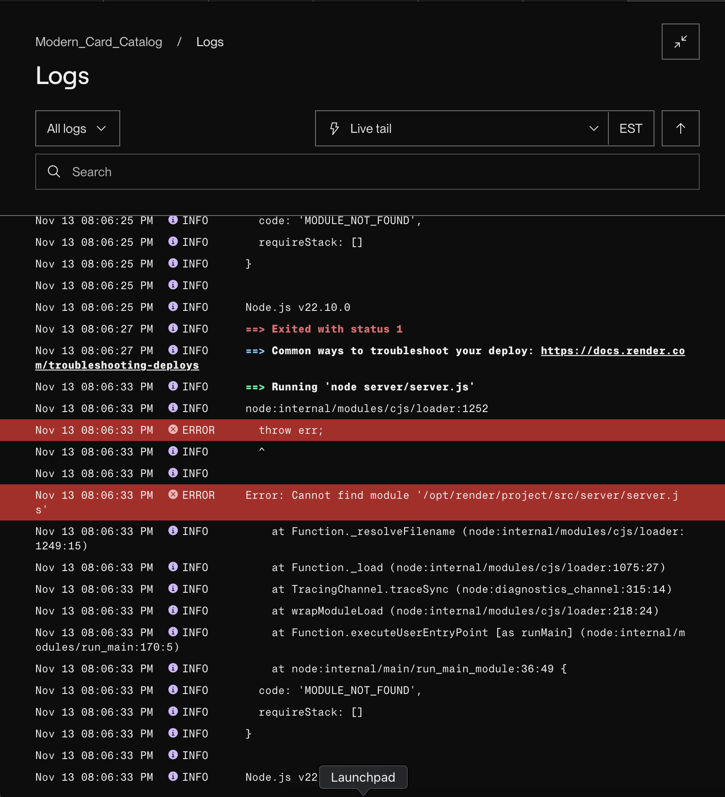

# Modern_Card_Catalog
A book search using Google Books API.

## Description

- I want to preface this by noting that the render site is not working as the build keeps failing (there is an error in the node_modules/render src folder thats generated for the project).
- I've tried to read the documentation for this error thats online but I can't figure out whats breaking it. I am getting together with someone this week/end to go over how to fix it and why its occuring so the link should be running in a few days.

## Table of Contents

- [Usage](#usage)
- [Credits](#credits)
- [License](#license)
- [Authors](#authors)

## Usage

[Render Site](https://modern-card-catalog.onrender.com/)

## Credits
Google Books API belongs to Google.

***Starter code belongs to BootcampSpot/EdX/Rutgers***

## License

---
## Authors
Catherine Zappia | [Github](https://www.github.com/catzappia)   [e-mail](catherinemzappia@gmail.com)

## Version History
- 0.1 (beta)
  - Initial Release.

